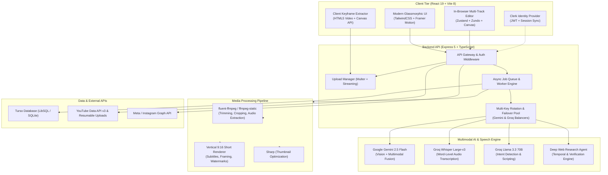
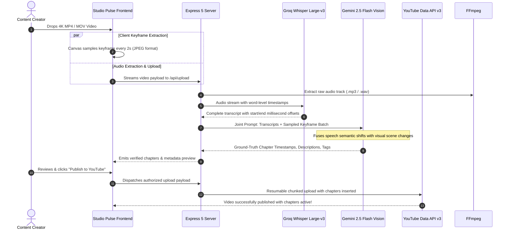
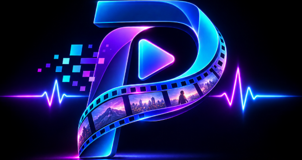
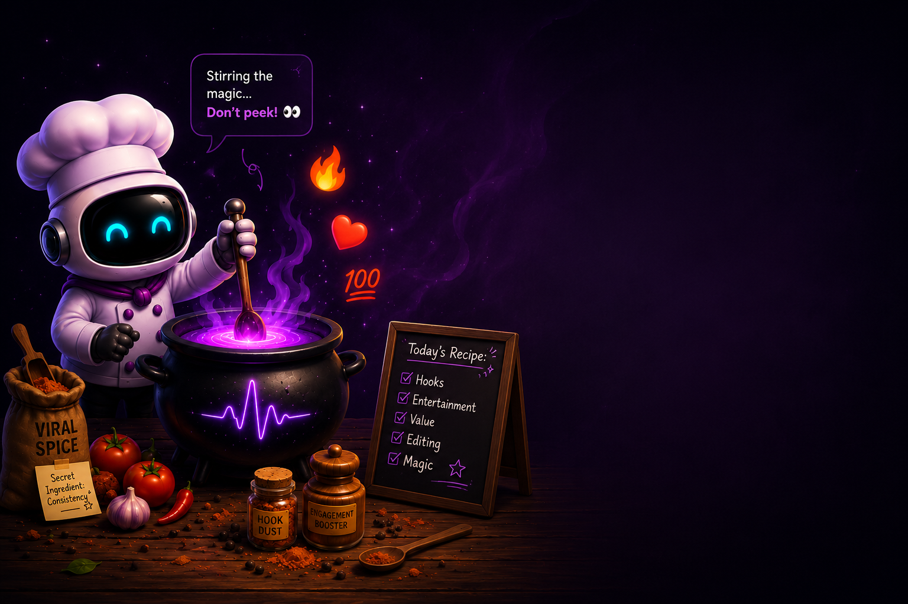
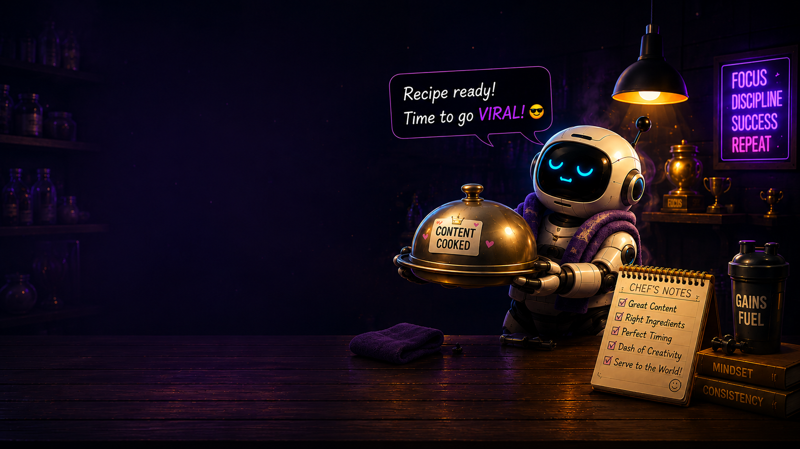

<div align="center">

# ⚡ STUDIO PULSE
### The Autonomous Multimodal AI Creator Studio & Video Production Suite

[](https://react.dev/)
[](https://www.typescriptlang.org/)
[](https://vitejs.dev/)
[](https://tailwindcss.com/)
[](https://expressjs.com/)
[](https://ai.google.dev/)
[](https://groq.com/)
[](https://turso.tech/)
[](https://clerk.com/)
[](https://ffmpeg.org/)

<p align="center">
  <b>Transform raw footage into viral, multi-platform content with ground-truth AI vision, audio intelligence, an in-browser multi-track editor, and automated social distribution.</b>
</p>

[Key Features](#-key-features) • [Architecture](#-system-architecture) • [UI Showcase](#-ui-showcase) • [Tech Stack](#-technology-stack) • [Quickstart](#-quickstart-guide) • [Environment Setup](#-environment-variables) • [Project Structure](#-project-structure)

---

</div>

## 🌟 Overview

**Studio Pulse** is an all-in-one AI operating system engineered for modern video creators, editors, and digital agencies. By fusing **Google Gemini 2.5 Flash multimodal vision**, **Groq Whisper speech transcription**, **Llama 3.3 70B language reasoning**, and a **custom in-browser non-linear video editor (NLE)**, Studio Pulse eliminates hours of manual editing, timeline clipping, chapter generation, and audience engagement management.

Whether you are converting a 60-minute podcast into 10 viral 9:16 vertical shorts, seeking frame-accurate auto-chapters without hallucinations, editing tracks in a precision browser timeline, or automating cross-platform social publishing, Studio Pulse delivers studio-grade automation with high speed.

---

## ⚡ Key Features

### 1. 🎯 Ground-Truth Multimodal Auto-Chapters & Upload Center
- **Dual Visual + Auditory Grounding**: Unlike conventional tools that guess timestamps from transcripts alone, Studio Pulse samples high-res keyframes every 2–3 seconds and synchronizes them with Whisper word-level audio timestamps.
- **Hallucination-Free Timestamps**: Gemini 2.5 Flash cross-examines audio transitions against visual scene switches to generate 100% accurate YouTube chapter titles, descriptions, and searchable key moments.
- **Smart Metadata Suite**: Instantly synthesizes high-CTR video titles, SEO-optimized descriptions, target hashtags, tags, and category classifications.
- **Direct YouTube Publishing**: Seamless 1-click video upload to YouTube Data API v3 with privacy controls (`public`, `unlisted`, `private`).

### 2. ✂️ Pulse Clips — AI Viral Short Generator
- **Long-to-Shorts Pipeline**: Automatically transforms horizontal long-form videos into vertical (9:16) format for YouTube Shorts, Instagram Reels, and TikTok.
- **AI Virality Scoring (0–100)**: Evaluates speaker pacing, emotion, hook strength, and punchlines to surface clips with the highest viral probability.
- **Kinetic Subtitles & Emoji Accents**: Burn dynamic, word-by-word animated captions with custom color palettes, shadow styles, and emoji highlights.
- **Speaker Framing**: Smart cropping centered on active speakers with motion tracking.

### 3. 🎬 In-Browser Multi-Track Non-Linear Video Editor
- **Multi-Track Timeline**: Independent layered tracks for Video, Audio, B-Roll, Subtitles, and Graphic Overlays.
- **Precision Trimming & Splitting**: Frame-accurate playhead scrubber, magnetic snap, ripple delete, speed ramping (0.25x – 4x), and volume ducking.
- **AI Assistant Command Center**: Control your timeline with natural language prompts (e.g., *"cut all pauses longer than 1 second"*, *"add kinetic captions to the selected clip"*, *"fade out audio at 0:45"*).
- **Undo/Redo with Zundo**: Full state history preserving every cut, move, and edit action.
- **Server-Side FFmpeg Engine**: Export crisp 1080p/4K master files directly from browser timeline recipes.

### 4. 🧠 Studio AI Copilot & Deep Research Agent
- **Context-Aware Creator Agent**: Integrated chat assistant that understands your channel data, uploaded media, transcripts, and audience analytics.
- **Cosmic Web Research Mode**: Autonomous research engine equipped with temporal awareness, multi-source fact verification, and synthesized executive dossiers for video topic ideation.
- **Interactive Multi-Key Rotation**: Resilient query routing across Gemini and Groq key pools to eliminate rate-limit roadblocks.

### 5. 💬 Audience Tone & Sentiment Intelligence
- **Live Channel Ingestion**: Pulls real-time comments, likes, and engagement metrics via YouTube Data API.
- **Emotion & Tone Radar**: Categorizes viewer comments into Joy, Hype, Frustration, Confusion, and Constructive Feedback.
- **Persona-Aligned Auto-Replies**: Drafts contextual, high-engagement replies reflecting your unique channel voice with 1-click instant posting.

### 6. 📅 Autopilot Scheduler & Content Pipeline
- **AI Content Calendar**: Visual drag-and-drop editorial calendar for upcoming releases.
- **Peak Timing Algorithm**: Recommends optimal publishing windows tailored to your historical audience activity.
- **Multi-Platform Ready**: Architecture supports YouTube, Instagram, Facebook, and TikTok workflows.

### 7. 🛡️ Resilient Multi-Key API Pooling
- **Automated Round-Robin**: Supports up to 10 distinct API keys each for Gemini and Groq.
- **Intelligent Fallback**: Catches HTTP 429 rate limits, cooling down throttled keys and hot-swapping instantly to an active key.

---

## 🏛️ System Architecture



---

## 🎬 Ground-Truth Auto-Chapters Data Flow



---

## 📸 UI Showcase

| In-Browser Video Editor | Pulse Clips Viral Studio |
| :---: | :---: |
|  |  |
| *Multi-track timeline with precision playhead, trimming, splitting, and AI command bar* | *Automated short-form vertical generation with kinetic subtitles and virality score* |

| AI Multimodal Agent & Cosmic Research | Clip Generation Progress |
| :---: | :---: |
|  |  |
| *Deep web search synthesis with source inspection, temporal anchoring, and creator coaching* | *Real-time rendering status for high-definition 9:16 short exports* |

---

## 🛠️ Technology Stack

| Layer | Technology | Purpose |
| :--- | :--- | :--- |
| **Frontend Framework** | `React 19.2` | Ultra-fast declarative UI with React compiler compatibility |
| **Build Tool** | `Vite 8.0` | Instant HMR development server and optimized rollup bundling |
| **Language** | `TypeScript 6.0` | End-to-end type safety across client and server |
| **Styling & UI** | `TailwindCSS 3.4` + `Lucide React` | Responsive glassmorphic design system and icon library |
| **Motion & 3D** | `Framer Motion 12` + `@splinetool/react-spline` | Micro-interactions, timeline transitions, and 3D scenes |
| **State Management** | `Zustand 5` + `Zundo 2` | Global store with automated undo/redo timeline history |
| **Data Fetching** | `@tanstack/react-query 5` | Server state caching, optimistic updates, and polling |
| **Backend Server** | `Express 5.2` + `TSX` | High-throughput Node.js runtime with modern Express 5 |
| **Database** | `LibSQL / Turso Client` | Serverless, edge-ready distributed SQLite database |
| **Authentication** | `Clerk React 5` | Enterprise authentication, social OAuth, and session tokens |
| **Computer Vision AI** | `Google Gemini 2.5 Flash` | Multimodal frame processing, scene analysis, and auto-chapters |
| **Speech Intelligence** | `Groq Whisper Large-v3` | Millisecond-level word timestamped transcription |
| **LLM Reasoning** | `Groq Llama 3.3 70B Versatile` | Intent routing, title synthesis, viral hook extraction |
| **Media Processing** | `fluent-ffmpeg` + `ffmpeg-static` | Video transcoding, vertical crop, audio extraction, overlays |
| **Image Processing** | `Sharp 0.35` | Ultra-fast thumbnail resize, keyframe compression, webp conversion |
| **Analytics Charts** | `Recharts 3.8` | Real-time performance, sentiment distribution, and engagement curves |

---

## 📁 Project Structure

```text
studiopulse-devenger/
├── .env.example                     # Comprehensive sanitized environment template
├── .gitignore                       # Multi-tier gitignore protecting all secrets & media
├── package.json                     # Monorepo dependencies and execution scripts
├── vite.config.ts                   # Vite configuration with path aliases (@/)
├── tsconfig.json                    # Strict TypeScript compiler options
│
├── public/                          # Static brand assets, demo previews, and icons
│   ├── editor.png                   # Video editor screenshot
│   ├── clipgen.png                  # Viral clips screenshot
│   └── web.png                      # Cosmic research UI screenshot
│
├── src/                             # Frontend Source Code (React 19)
│   ├── App.tsx                      # Root routes, Clerk provider, and layout registry
│   ├── index.css                    # Tailwind design tokens, cosmic themes, animations
│   ├── main.tsx                     # React 19 bootstrap mount
│   ├── components/
│   │   ├── common/                  # GlobalCommandPalette, Skeleton, UI primitives
│   │   ├── layout/                  # Sidebar, Navbar, Header, UserMenu
│   │   ├── studio-ai/               # CosmicWebModeView, Chat, ThinkingIndicator
│   │   ├── video-editor/            # Timeline, TimelineTrack, TimelineClip, VideoPreview,
│   │   │                            # Toolbar, MediaLibrary, InspectorPanel, ExportModal,
│   │   │                            # AICommandCenter, EditPlanModal, editor.css
│   │   └── viral-clips/             # ViralClipsStudio, ClipPreviewModal, ViralVideoList
│   ├── hooks/                       # Custom React hooks (useStudioAI, useEditorStore,
│   │                                # useViralClips, useUpload, useAudienceAnalysis, etc.)
│   ├── pages/                       # Application Views:
│   │   ├── LandingPage.tsx          # High-converting marketing landing page
│   │   ├── DashboardPage.tsx        # Creator KPI analytics and quick actions
│   │   ├── VideoEditorPage.tsx      # Full-viewport multi-track NLE editor
│   │   ├── ViralClipsPage.tsx       # AI vertical short extraction studio
│   │   ├── UploadCenterPage.tsx     # Frame-accurate auto-chapter upload pipeline
│   │   ├── StudioAIPage.tsx         # Multimodal creator assistant
│   │   ├── AudiencePage.tsx         # Sentiment analysis and auto-replies
│   │   ├── AutopilotPage.tsx        # Autonomous scheduling and queue
│   │   ├── MyVideosPage.tsx         # Video library with sync capabilities
│   │   └── AnalyticsPage.tsx        # Audience retention, views, and reach graphs
│   └── utils/                       # extractVideoFrames.ts, formatting, helpers
│
└── server/                          # Backend API (Express 5 + TypeScript)
    ├── index.ts                     # Server entrypoint, middleware, static mounts
    ├── db.ts                        # Turso / LibSQL client and schema migrations
    ├── ai/                          # AI Engines:
    │   ├── gemini.ts                # Gemini 2.5 Flash client + 10-key rotation pool
    │   ├── groq.ts                  # Groq client + 10-key rotation pool (Whisper & Llama)
    │   ├── audio-intelligence.ts    # Whisper transcription & silence detection
    │   ├── intent-detector.ts       # Query classification & action dispatch
    │   ├── orchestrator.ts          # Multi-agent synthesis pipeline
    │   ├── pulse-clips-engine.ts    # Viral segment extraction algorithm
    │   ├── editor-agent.ts          # Natural language timeline edit planner
    │   ├── editor-render.ts         # FFmpeg rendering engine for browser recipes
    │   └── research/                # Deep web research agent, temporal engine, verification
    ├── audience/                    # Sentiment and tone analyzers
    ├── autopilot/                   # Scheduling engine and background workers
    ├── clips/                       # Short video renderer and publisher adapters
    ├── integrations/                # YouTube Data API v3 and OAuth handlers
    └── routes/                      # REST endpoints (/upload, /videos, /ai, /editor, etc.)
```

---

## 🚀 Quickstart Guide

### 1. Prerequisites
- **Node.js**: v18.0.0 or higher (v20+ recommended)
- **npm**: v9.0.0 or higher
- **Git**: Installed and configured

*(Note: `ffmpeg-static` and `ffprobe-static` are bundled automatically via npm dependencies, so manual system FFmpeg installation is optional).*

### 2. Clone the Repository
```bash
git clone https://github.com/AbdullahAnsari103/studiopulse-devenger.git
cd studiopulse-devenger
```

### 3. Install Dependencies
```bash
npm install
```

### 4. Configure Environment Variables
Copy the sanitized environment template:
```bash
cp .env.example .env
```
Open `.env` in your editor and supply your service credentials (see [Environment Setup](#-environment-variables) below).

### 5. Launch the Development Environment
Start both the client and server concurrently:

```bash
# Terminal 1: Backend Express Server (Port 3001)
npm run server:dev

# Terminal 2: Frontend Vite Dev Server (Port 5173)
npm run dev
```

Navigate to `http://localhost:5173` in your browser.

---

## 🔐 Environment Variables

Studio Pulse uses a clean separation between client-safe variables (`VITE_*`) and sensitive backend credentials. Reference `.env.example` for the complete list:

### Core Configuration
```env
PORT=3001
NODE_ENV=development
FRONTEND_URL=http://localhost:5173
```

### Authentication (Clerk)
```env
VITE_CLERK_PUBLISHABLE_KEY=pk_test_...
CLERK_SECRET_KEY=sk_test_...
```

### Database (Turso / LibSQL)
```env
# Cloud Turso DB
TURSO_DATABASE_URL=libsql://your-db.turso.io
TURSO_AUTH_TOKEN=your-turso-auth-token

# Or Local SQLite (Fallback)
DATABASE_PATH=./studiopulse.db
```

### AI Key Pooling (Gemini & Groq)
Studio Pulse features automatic load balancing and failover across multiple keys. Add as many as needed:
```env
# Primary AI Keys
GEMINI_API_KEY=AIzaSy...
GROQ_API_KEY=gsk_...

# Gemini Multi-Key Rotation Pool (Up to 10 keys)
GEMINI_API_KEY_1=AIzaSy...
GEMINI_API_KEY_2=AIzaSy...

# Groq Multi-Key Rotation Pool (Up to 10 keys)
GROQ_API_KEY_1=gsk_...
GROQ_API_KEY_2=gsk_...
```

### YouTube API & OAuth
```env
YOUTUBE_CLIENT_ID=your_client_id.apps.googleusercontent.com
YOUTUBE_CLIENT_SECRET=GOCSPX-...
YOUTUBE_REDIRECT_URI=http://localhost:3001/api/platforms/youtube/callback
```

### Meta / Instagram Graph API (Optional)
```env
META_APP_ID=your_meta_app_id
META_APP_SECRET=your_meta_app_secret
```

---

## 📦 Available Scripts

| Command | Action |
| :--- | :--- |
| `npm run dev` | Starts Vite frontend dev server with Hot Module Replacement on `http://localhost:5173` |
| `npm run server:dev` | Starts Express backend with `tsx watch` for auto-reload on `http://localhost:3001` |
| `npm run build` | Compiles TypeScript (`tsc -b`) and bundles production assets with Vite |
| `npm run lint` | Runs ESLint across the codebase |
| `npm run preview` | Locally serves the built production bundle for preview |

---

## 🛡️ Security & Privacy Assurance

- **Zero Hardcoded Secrets**: Studio Pulse strictly enforces zero secret exposure. All credentials are provided via `.env` which is excluded in `.gitignore`.
- **Token Encryption**: Sensitive third-party tokens (YouTube OAuth tokens, refresh tokens) are encrypted before writing to the database using `crypto-js`.
- **CORS Protection**: Access to backend endpoints is restricted to authorized origins.
- **Client Sanitization**: All client-uploaded video files and intermediate frames are stored within designated sandbox upload directories.

---

## 🤝 Contributing

Contributions, issues, and feature suggestions are welcome!

1. Fork the repository (`https://github.com/AbdullahAnsari103/studiopulse-devenger/fork`)
2. Create your feature branch (`git checkout -b feature/amazing-feature`)
3. Commit your changes (`git commit -m 'feat: add amazing feature'`)
4. Push to the branch (`git push origin feature/amazing-feature`)
5. Open a Pull Request

---

## 📜 License

Distributed under the MIT License. See `LICENSE` for more information.

---

<div align="center">
  <b>Built with ❤️ for Creators worldwide by <a href="https://github.com/AbdullahAnsari103">Abdullah Ansari</a></b>
</div>
