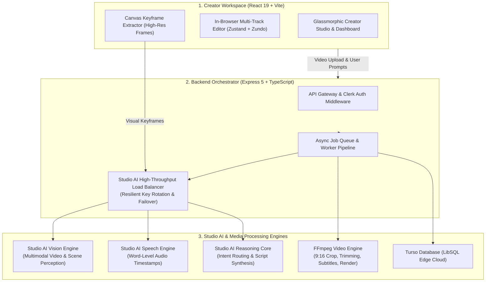
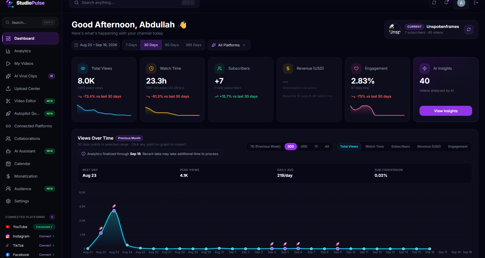
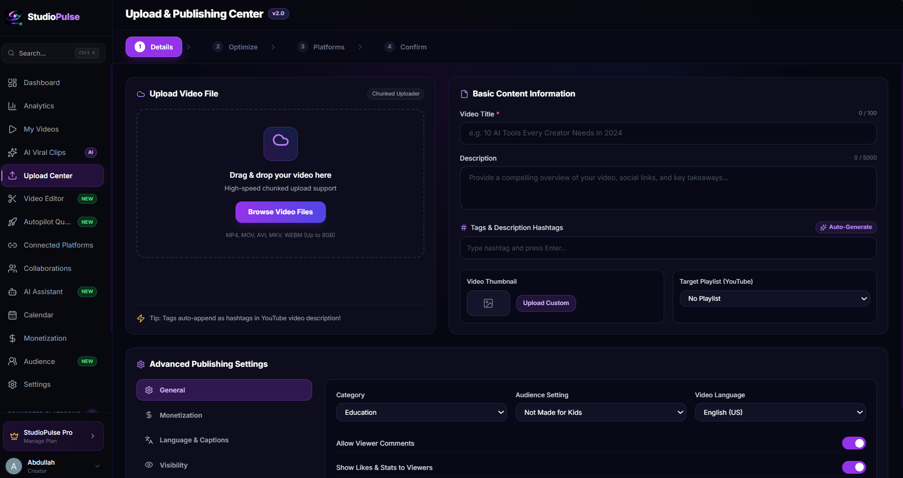
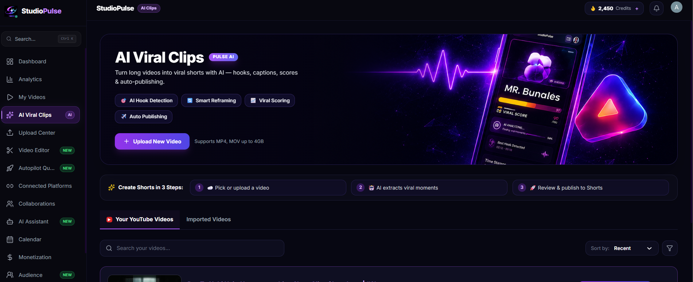
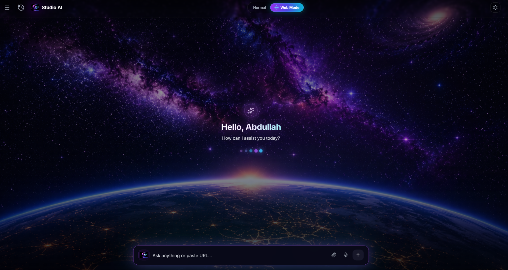
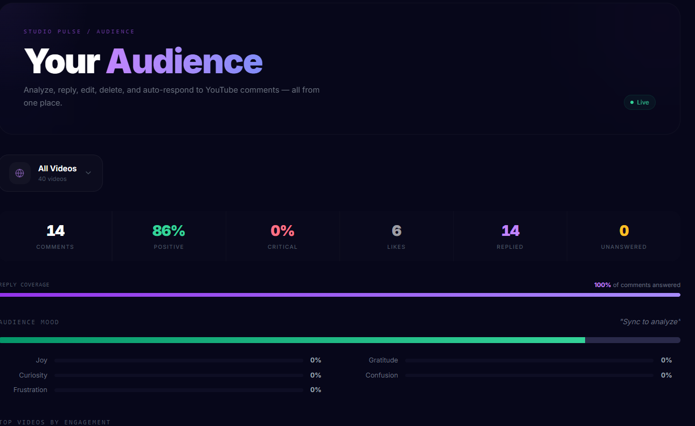

<div align="center">

# ⚡ STUDIO PULSE
### The Autonomous Multimodal AI Creator Studio & Video Production Suite

[](https://react.dev/)
[](https://www.typescriptlang.org/)
[](https://vitejs.dev/)
[](https://tailwindcss.com/)
[](https://expressjs.com/)
[](#)
[](#)
[](https://turso.tech/)
[](https://clerk.com/)
[](https://ffmpeg.org/)

<p align="center">
  <b>A unified multimodal operating system transforming raw footage into viral, multi-platform releases with ground-truth Studio AI vision, audio intelligence, an in-browser multi-track editor, and automated social distribution.</b>
</p>

[The Problem](#-the-problem-why-creator-workflows-are-broken) • [The Solution](#-the-solution-studio-pulse) • [Architecture](#-simplified-system-architecture) • [Core Capabilities](#-core-capabilities) • [UI Showcase](#-ui-showcase) • [Tech Stack](#-technology-stack) • [Developer Reference](#-developer-reference)

---

</div>

## 🔴 The Problem: Why Creator Workflows Are Broken

Modern digital creators, podcasters, and media agencies face severe friction across their production pipelines:

| Friction Point | The Industry Reality | The Direct Consequence |
| :--- | :--- | :--- |
| **1. Hallucinated Timestamps** | Conventional AI tools generate YouTube chapters from text transcripts alone without visual frame context. | AI invents approximate, rounded timestamps (`1:00`, `2:00`) that drift seconds away from actual scene transitions, destroying video SEO and viewer navigation. |
| **2. Short Repurposing Fatigue** | Converting a 45-minute horizontal video into 10 vertical (9:16) shorts takes 4–6 hours of manual clipping, re-centering speakers, and adding animated captions. | Creators post inconsistently on Shorts, Reels, and TikTok, sacrificing algorithmic reach and viral discovery. |
| **3. Fragmented Tooling Sprawl** | Creators bounce between 4–6 siloed apps: desktop NLEs (Premiere/CapCut), separate transcription tools, AI script writers, thumbnail generators, and scheduling spreadsheets. | Disjointed workflows, slow turnaround times, high software subscription overhead, and endless file re-exporting. |
| **4. AI Rate-Limit Chokepoints** | Heavy video analysis (extracting dozens of frames, full audio transcription, script generation) quickly exhausts single API limits. | Creator workflows freeze mid-batch, causing rendering crashes and inconsistent production timelines. |
| **5. Audience Engagement Decay** | High-velocity channels receive hundreds of comments daily across multiple platforms that go unread or unreplied. | Low viewer retention, missed community signals, and lost recommendation boost from platform algorithms. |

---

## 🟢 The Solution: Studio Pulse

**Studio Pulse** unites every phase of modern video production into a single, high-performance workspace powered by **Studio AI**:

1. **Ground-Truth Audiovisual Fusion**: Real-time canvas keyframe extraction synchronized with millisecond speech timestamps enables the **Studio AI Multimodal Engine** to generate 100% accurate, hallucination-free YouTube chapters and summaries.
2. **Autonomous Viral Short Generation (Pulse Clips)**: Transforms long-form videos into 9:16 vertical shorts with automated speaker framing, virality scoring (0–100), and kinetic word-by-word animated subtitles.
3. **In-Browser Multi-Track Editor**: A full-featured non-linear editor with multi-track timeline, precision trimming, Zundo undo/redo history, natural language Studio AI editing commands, and server-side FFmpeg rendering.
4. **Resilient High-Throughput Studio AI Pools**: Intelligent round-robin key pooling with automatic 429 rate-limit backoff, ensuring 99.9% uptime under heavy production loads.
5. **Audience Sentiment Intelligence**: Ingests YouTube channel comments, charts audience emotional tone, and drafts high-converting, persona-aligned replies for instant 1-click publishing.

---

## 🏛️ Simplified System Architecture



---

## ⚡ Core Capabilities

### 1. 🎯 Ground-Truth Multimodal Auto-Chapters
- **Audiovisual Verification**: Captures visual canvas frames every 2–3 seconds and aligns them with Studio AI word-level speech timestamps.
- **Zero Hallucination**: Prevents arbitrary, rounded timestamps; each chapter boundary is verified against visual scene transitions and spoken milestones.
- **YouTube 1-Click Sync**: Publishes video metadata, auto-chapters, optimized titles, and tags directly to YouTube Data API v3 with custom privacy settings (`public`, `unlisted`, `private`).

### 2. ✂️ Pulse Clips — Viral Short Maker
- **Smart 9:16 Vertical Cropping**: Automatically detects active speakers and centers framing for mobile consumption.
- **Virality Scoring Algorithm (0–100)**: Detects verbal hooks, emotional peaks, and punchlines to extract high-retention segments.
- **Kinetic Subtitles & Emoji Accents**: Generates word-by-word animated subtitles with custom color palettes and styling.

### 3. 🎬 In-Browser Multi-Track Video Editor
- **Multi-Track Timeline**: Independent tracks for Video, Audio, B-Roll, Subtitles, and Graphic Overlays.
- **Precision Trimming & Splitting**: Scrubber playhead with magnetic snapping, ripple deletion, speed ramping (0.25x – 4x), and volume ducking.
- **Natural Language Studio AI Commands**: Issue conversational edits (*"cut pauses longer than 1s"*, *"add kinetic captions"*, *"fade out audio at the end"*).
- **Non-Destructive History**: Undo/Redo state powered by Zundo.
- **Server FFmpeg Rendering**: Exports high-definition master files from browser timeline instructions.

### 4. 🧠 Studio AI Copilot & Cosmic Web Research
- **Context-Aware Creator Assistant**: Deep understanding of your uploaded media, transcripts, and channel performance.
- **Deep Web Research**: Autonomous fact verification, temporal anchoring, and structured executive dossiers for video topic ideation.

### 5. 💬 Audience Sentiment & Tone Radar
- **Live Channel Analysis**: Pulls YouTube comments and engagement metrics.
- **Emotion Classification**: Categorizes audience sentiment into Joy, Hype, Frustration, Confusion, and Feedback.
- **Persona-Aligned Auto-Replies**: Drafts contextual, high-engagement replies reflecting channel voice with 1-click posting.

### 6. 🛡️ Resilient Studio AI Pooling
- **Automated Round-Robin**: High-throughput load balancing across Studio AI engine keys.
- **Intelligent Fallback**: Proactively detects rate limits, cooling down throttled channels and hot-swapping instantly to an active key.

---

## 📸 Live Application Showcase (Connected YouTube Channel)

The following screenshots demonstrate Studio Pulse actively synchronized with a live YouTube creator channel (`Unspokenframes`), showcasing end-to-end data synchronization, multimodal intelligence, and automated video workflows:

### 1. 📊 Creator Analytics & Channel Dashboard
Real-time ingestion of live YouTube channel analytics showing 30-day views (8.0K views), watch time (23.3h), subscriber growth, engagement curves, and historical performance trajectory:
<div align="center">
  
</div>

<br/>

### 2. 🎬 Upload & Publishing Center v2.0
High-speed chunked upload pipeline with automated Studio AI ground-truth chapters, SEO title generator, hashtag optimization, custom thumbnail selection, and 1-click YouTube playlist sync:
<div align="center">
  
</div>

<br/>

### 3. ✂️ AI Viral Clips Studio (Pulse AI)
Automated 3-step short-form studio with imported videos directly from the connected YouTube channel. Features AI hook detection, smart 9:16 vertical re-framing, virality scoring (0–100), and kinetic subtitles:
<div align="center">
  
</div>

<br/>

### 4. 🧠 Studio AI Cosmic Agent (Normal & Deep Web Mode)
Autonomous creator copilot featuring normal conversation and deep web research mode with live source verification, fact checking, and executive dossier synthesis:
<div align="center">
  
</div>

<br/>

### 5. 💬 "Your Audience" Sentiment Intelligence
Live YouTube comment ingestion with emotional tone radar, positive/critical sentiment classification (86% positive), mood indicators, and 1-click persona-aligned auto-reply coverage:
<div align="center">
  
</div>

<br/>

### 6. 🎛️ In-Browser Multi-Track Video Editor
Full-featured non-linear timeline editor with layered tracks for video, audio, captions, b-roll, precision playhead scrubbing, and natural language Studio AI command execution:
<div align="center">
  
</div>

---

## 🛠️ Technology Stack

| Layer | Technology | Purpose |
| :--- | :--- | :--- |
| **Frontend Framework** | `React 19.2` | Declarative UI with React compiler compatibility |
| **Build Tool** | `Vite 8.0` | High-speed HMR development server and optimized bundling |
| **Language** | `TypeScript 6.0` | End-to-end type safety across client and server |
| **Styling & UI** | `TailwindCSS 3.4` + `Lucide React` | Responsive glassmorphic design system and icons |
| **Motion & 3D** | `Framer Motion 12` + `@splinetool/react-spline` | Timeline interactions and 3D scenes |
| **State Management** | `Zustand 5` + `Zundo 2` | Global store with automated undo/redo timeline history |
| **Data Fetching** | `@tanstack/react-query 5` | Server state caching, optimistic updates, and polling |
| **Backend Server** | `Express 5.2` + `TSX` | High-throughput runtime with modern Express 5 |
| **Database** | `LibSQL / Turso Client` | Serverless, edge-ready distributed SQLite database |
| **Authentication** | `Clerk React 5` | Enterprise authentication, social OAuth, and session tokens |
| **Computer Vision AI** | `Studio AI Multimodal Vision` | Multimodal frame processing, scene analysis, and auto-chapters |
| **Speech Intelligence** | `Studio AI Speech Intelligence` | Millisecond-level word timestamped transcription |
| **LLM Reasoning** | `Studio AI Reasoning Core` | Intent routing, title synthesis, viral hook extraction |
| **Media Processing** | `fluent-ffmpeg` + `ffmpeg-static` | Video transcoding, vertical crop, audio extraction, overlays |
| **Image Processing** | `Sharp 0.35` | Thumbnail resize, keyframe compression, webp conversion |
| **Analytics Charts** | `Recharts 3.8` | Real-time performance, sentiment distribution, and engagement curves |

---

## 📁 Project Structure

```text
studiopulse-devenger/
├── .env.example                     # Comprehensive sanitized environment template
├── .gitignore                       # Strict multi-tier security filter protecting all secrets
├── package.json                     # Monorepo dependencies and execution scripts
├── vite.config.ts                   # Vite configuration with path aliases (@/)
│
├── public/                          # Static brand assets, demo previews, and icons
│   ├── editor.png                   # Video editor screenshot
│   ├── clipgen.png                  # Viral clips screenshot
│   └── web.png                      # Cosmic research UI screenshot
│
├── src/                             # Frontend Source Code (React 19)
│   ├── App.tsx                      # Root routes, Clerk provider, and layout registry
│   ├── index.css                    # Tailwind design tokens, cosmic themes, animations
│   ├── components/
│   │   ├── common/                  # GlobalCommandPalette, Skeleton, UI primitives
│   │   ├── studio-ai/               # CosmicWebModeView, Chat, ThinkingIndicator
│   │   ├── video-editor/            # Timeline, TimelineTrack, TimelineClip, VideoPreview,
│   │   │                            # Toolbar, MediaLibrary, InspectorPanel, ExportModal,
│   │   │                            # AICommandCenter, EditPlanModal, editor.css
│   │   └── viral-clips/             # ViralClipsStudio, ClipPreviewModal, ViralVideoList
│   ├── hooks/                       # Custom hooks (useStudioAI, useEditorStore, useViralClips, etc.)
│   ├── pages/                       # Dashboard, VideoEditor, ViralClips, UploadCenter, etc.
│   └── utils/                       # extractVideoFrames.ts, formatting, helpers
│
└── server/                          # Backend API (Express 5 + TypeScript)
    ├── index.ts                     # Server entrypoint, middleware, static mounts
    ├── db.ts                        # Turso / LibSQL client and schema migrations
    ├── ai/                          # Studio AI Engines (Vision, speech, reasoning, research agent)
    ├── audience/                    # Sentiment and tone analyzers
    ├── autopilot/                   # Scheduling engine and background workers
    ├── clips/                       # Short video renderer and publisher adapters
    ├── integrations/                # YouTube Data API v3 and OAuth handlers
    └── routes/                      # REST endpoints (/upload, /videos, /ai, /editor, etc.)
```

---

## ⚙️ Developer Reference

### Execution Scripts

| Command | Description |
| :--- | :--- |
| `npm run dev` | Starts Vite frontend dev server with HMR on `http://localhost:5173` |
| `npm run server:dev` | Starts Express backend with `tsx watch` for auto-reload on `http://localhost:3001` |
| `npm run build` | Compiles TypeScript (`tsc -b`) and bundles production assets with Vite |
| `npm run lint` | Runs ESLint across the codebase |
| `npm run preview` | Serves the production build locally for verification |

### Environment Configuration Overview
The codebase includes a fully documented, sanitized [`.env.example`](.env.example) template covering all service integrations:
- **Authentication**: Clerk Publishable & Secret Keys
- **Database**: Turso Cloud Database URL & Auth Token (or local SQLite fallback)
- **Studio AI Engine Keys**: High-throughput multi-key rotation arrays for Studio AI processing pipelines
- **YouTube API**: Google Cloud OAuth Client ID, Secret, and Redirect URI
- **Meta / Instagram**: Graph API Application ID & Secret

---

## 🛡️ Security & Privacy Assurance

- **Zero Secrets in Repository**: Automated scanning validates zero hardcoded credentials. All secret keys are excluded via `.gitignore`.
- **Encrypted Token Storage**: External platform OAuth tokens (YouTube access & refresh tokens) are encrypted with `crypto-js` before persisting to database storage.
- **Sandboxed File Processing**: All user uploads and intermediate render files are strictly processed within isolated directories.

---

<div align="center">
  <b>Built with ❤️ for Creators worldwide by <a href="https://github.com/AbdullahAnsari103">Abdullah Ansari</a></b>
</div>
